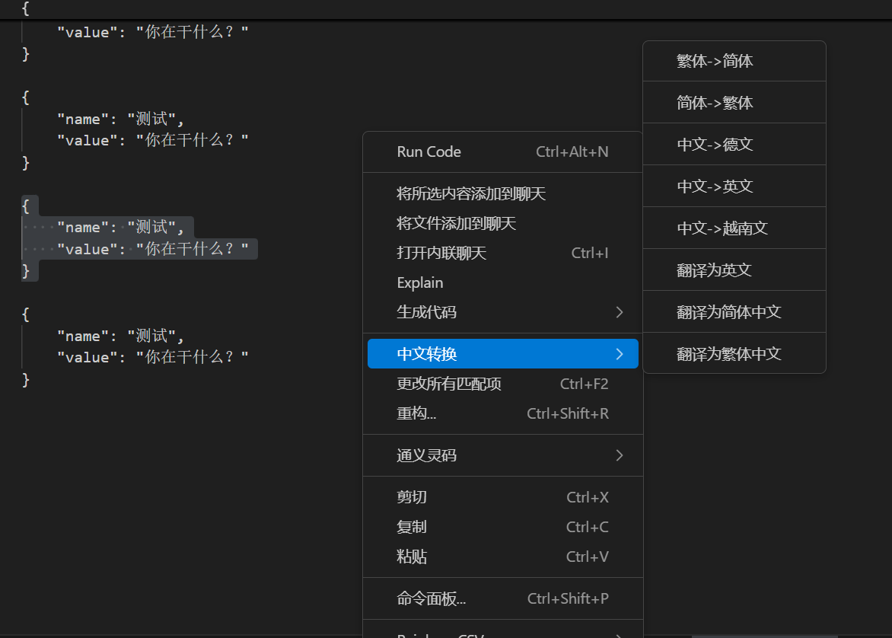

# Chinese Converter

这是一个VSCode扩展，允许您在编辑器中轻松地进行简体中文与繁体中文之间的转换，以及多种语言的翻译功能。

## 功能

- **简体转繁体**：选中文本后，在右键菜单的"中文转换"子菜单中选择"简体->繁体"进行转换
- **繁体转简体**：选中文本后，在右键菜单的"中文转换"子菜单中选择"繁体->简体"进行转换
- **多语言翻译**：在右键菜单的"中文转换"子菜单中可以找到以下功能：
  - 中文->英文
  - 中文->德文
  - 中文->越南文
  - 翻译为英文
  - 翻译为简体中文
  - 翻译为繁体中文

## 安装要求

- VSCode 1.60 或更高版本
- Python 3.x
- pip 包管理器

## 安装步骤

1. 在VSCode中打开命令面板 (Ctrl+Shift+P)
2. 运行 "Extensions: Install from VSIX..." 命令
3. 选择扩展包文件进行安装
4. 重启VSCode

## 使用方法

1. 在编辑器中选择您想要转换的中文文本
2. 右键单击选中的文本
3. 在上下文菜单中选择"中文转换"子菜单
4. 在子菜单中，您将看到多个选项：
   - "繁体->简体" - 将选中文本从繁体转换为简体
   - "简体->繁体" - 将选中文本从简体转换为繁体
   - "中文->英文" - 将中文翻译为英文
   - "中文->德文" - 将中文翻译为德文
   - "中文->越南文" - 将中文翻译为越南文
   - "翻译为英文" - 将中文翻译为英文
   - "翻译为简体中文" - 将英文翻译为简体中文
   - "翻译为繁体中文" - 将英文翻译为繁体中文
5. 点击相应选项即可完成转换或翻译

## 技术细节

- 使用 opencc-python-reimplemented 库进行简繁体转换
- 利用 VSCode 扩展 API 实现上下文菜单集成
- 使用 python-shell 在 Node.js 和 Python 之间通信
- 支持多种翻译库（googletrans, deep-translator, translate）以提高翻译成功率
- 所有转换和翻译功能都整合在一个"中文转换"聚合菜单中，便于用户使用

## 注意事项

- 需要确保您的系统已正确安装Python并将其添加到PATH环境变量中
- 第一次运行扩展时，可能需要一些时间来安装Python依赖项
- 翻译功能依赖于在线翻译服务，需要网络连接
- 使用的翻译API库均免费，但有速率限制，建议单次请求不超过5000字，每分钟不超过100次

## 版本历史

- 1.0.0 - 初始版本，支持基本的简繁体转换功能，以及中文转为其它语系。